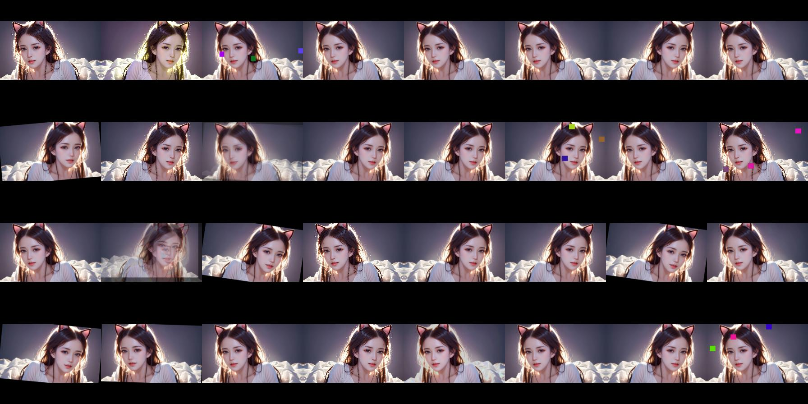

## <div align="center">VisionDK: ToolBox Of Image Classification & Face Recognition </div>

## Tutorials

<details open>
<summary>Install ☘️</summary>

```shell
# It is recommanded to create a separate virtual environment
conda create -n vision python=3.10 
conda activate vision

# torch==2.0.1(lower is also ok) -> https://pytorch.org/get-started/locally/
conda install pytorch torchvision torchaudio pytorch-cuda=11.8 -c pytorch -c nvidia -y # cuda-version
conda install pytorch torchvision torchaudio cpuonly -c pytorch -y # cpu-version

pip install -r requirements.txt

# For CBIR
conda install faiss-gpu=1.8.0 -c pytorch

# Without Arial.ttf, inference may be slow due to network IO.
mkdir -p ~/.config/DuKe
cp misc/Arial.ttf ~/.config/DuKe
```
</details>


<details close>
<summary>Training 🌟️</summary>

```shell
# one machine one gpu
python main.py --cfgs configs/task/pet.yaml

# one machine multiple gpus
CUDA_VISIBLE_DEVICES=0,1,2,3 torchrun --nproc_per_node 4 main.py --cfgs configs/classification/pet.yaml
                                                                 --sync_bn[Option: this will lead to training slowly]
                                                                 --resume[Option: training from checkpoint]
                                                                 --load_from[Option: training from fine-tuning]
```
</details>


## What's New
- [Apr. 2024]  [Face Recognition Task(FRT)](models/faceX/README.md) is supported now 🚀️️! We provide ResNet, EfficientNet, and Swin Transformer as backbone; As for head, ArcFace, CircleLoss, MegFace and MV Softmax could be used for training. **Note**: partial implementation refers to [JD-FaceX](https://github.com/JDAI-CV/FaceX-Zoo)
- [Jun. 2023]  [Image Classification Task(ICT)](models/classifier/README.md) has launched 🚀️️! Supporting many powerful strategies, such as progressive learning, online enhancement, beautiful training interface, exponential moving average, etc. The models are fully integrated into torchvision.
- [May. 2023]  The first initialization version of Vision.

## Which's task
1. [Face Recognition Task(FRT)](models/faceX/README.md)
2. [Image Classification Task(ICT)](models/classifier/README.md)

## Implemented Method & Paper
| Method                                                   | Paper                                                                           |
|----------------------------------------------------------|---------------------------------------------------------------------------------|
| [SAM](https://arxiv.org/abs/2010.01412v3)                | Sharpness-Aware Minimization for Efficiently Improving Generalization           |
| [Progressive Learning](https://arxiv.org/abs/2104.00298) | EfficientNetV2: Smaller Models and Faster Training                              |
| [OHEM](https://arxiv.org/abs/1604.03540)                 | Training Region-based Object Detectors with Online Hard Example Mining          |
| [Focal Loss](https://arxiv.org/abs/1708.02002)           | Focal Loss for Dense Object Detection                                           |
| [Cosine Annealing](https://arxiv.org/abs/1608.03983)     | SGDR: Stochastic Gradient Descent with Warm Restarts                            |
| [Label Smoothing](https://arxiv.org/abs/1512.00567)      | Rethinking the Inception Architecture for Computer Vision                       |
| [Mixup](https://arxiv.org/abs/1710.09412)                | MixUp: Beyond Empirical Risk Minimization                                       |
| [CutOut](https://arxiv.org/abs/1708.04552)               | Improved Regularization of Convolutional Neural Networks with Cutout            |
| [Attention Pool](https://arxiv.org/abs/2112.13692)       | Augmenting Convolutional networks with attention-based aggregation              |
| [GradCAM](https://arxiv.org/abs/1610.02391)              | Grad-CAM: Visual Explanations from Deep Networks via Gradient-based Localization |
| [ArcFace](https://arxiv.org/abs/1801.07698)              | ArcFace: Additive Angular Margin Loss for Deep Face Recognition |
| [CircleLoss](https://arxiv.org/abs/2002.10857)           | Circle Loss: A Unified Perspective of Pair Similarity Optimization |
| [MegFace](https://arxiv.org/abs/2103.06627)              | MagFace: A Universal Representation for Face Recognition and Quality Assessment |
| [MV Softmax](https://arxiv.org/abs/1912.00833)           | Mis-classified Vector Guided Softmax Loss for Face Recognition |

## Model & Paper

| Method                                                 | Paper                                                                 | Name in configs, eg: torchvision-mobilenet_v2                                   |
|--------------------------------------------------------|-----------------------------------------------------------------------|---------------------------------------------------------------------------------|
| [MobileNetv2](https://arxiv.org/abs/1801.04381)        | MobileNetV2: Inverted Residuals and Linear Bottlenecks           | mobilenet_v2                                                                    |
| [MobileNetv3](https://arxiv.org/abs/1905.02244)        | Searching for MobileNetV3                     | mobilenet_v3_small, mobilenet_v3_large                                          |
| [ShuffleNetv2](https://arxiv.org/abs/1807.11164)       | ShuffleNet V2: Practical Guidelines for Efficient CNN Architecture Design | shufflenet_v2_x0_5, shufflenet_v2_x1_0, shufflenet_v2_x1_5, shufflenet_v2_x2_0  |
| [ResNet](https://arxiv.org/abs/1512.03385)             | Deep Residual Learning for Image Recognition                                 | resnet18, resnet34, resnet50, resnet101, resnet152                              |
| [ResNeXt](https://arxiv.org/abs/1611.05431)            | Aggregated Residual Transformations for Deep Neural Networks                  | resnext50_32x4d, resnext101_32x8d, resnext101_64x4d                             |
| [ConvNext](https://arxiv.org/abs/2201.03545)           | A ConvNet for the 2020s             | convnext_tiny, convnext_small, convnext_base, convnext_large                    |
| [EfficientNet](https://arxiv.org/abs/1905.11946)       | EfficientNet: Rethinking Model Scaling for Convolutional Neural Networks                             | efficientnet_b{0..7}                                          |
| [EfficientNetv2](https://arxiv.org/abs/2104.00298)     | EfficientNetV2: Smaller Models and Faster Training  | efficientnet_v2_s, efficientnet_v2_m, efficientnet_v2_l            |
| [Swin Transformer](https://arxiv.org/abs/2103.14030)   | Swin Transformer: Hierarchical Vision Transformer using Shifted Windows    | swin_t, swin_s, swin_b              |
| [Swin Transformerv2](https://arxiv.org/abs/2111.09883) | Swin Transformer V2: Scaling Up Capacity and Resolution | swin_v2_t, swin_v2_s, swin_v2_b |


## Tools  
1. Split the data set into training set and validation set
```shell
python tools/data_prepare.py --postfix <jpg or png> --root <input your data realpath> --frac <train segment ratio, eg: 0.9 0.6 0.3 0.9 0.9>
```
2. Data augmented visualization 
```shell
cd visiondk
python -m tools.test_augment
```



## Contact Me
1. If you enjoy reproducing papers and algorithms, welcome to pull request.
2. If you have some confusion about the repo, please submit issues.