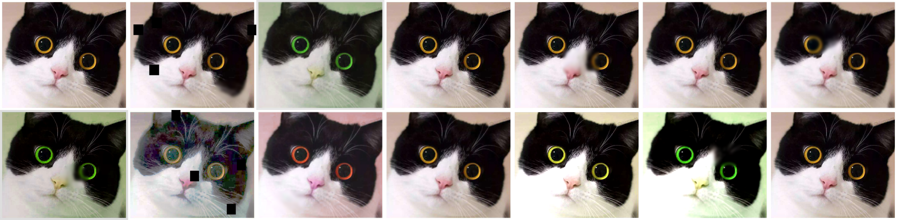

## <div align="center">vision classifier</div>
[English](./README.md)

## 使用指南

<details open>
<summary>环境 ☘️</summary>

```shell
conda create -n vision python=3.9 # 建议单独创建一个虚拟环境
conda activate vision

# torch==2.0.1(低几个版本也可以) -> https://pytorch.org/get-started/locally/
conda install pytorch torchvision torchaudio cpuonly -c pytorch # cpu版本
conda install pytorch torchvision torchaudio pytorch-cuda=11.8 -c pytorch -c nvidia # cuda版本

pip install -r requirements.txt

# 若无字体文件 推理可能会受网络IO影响导致非常缓慢
mkdir -p ~/.config/Ultralytics
cp misc/Arial.ttf ~/.config/Ultralytics
```
</details>

<details close>
<summary>数据 🚀️</summary>

[若学习使用, 转至oxford-iiit-pet](./oxford-iiit-pet/README.md)
```shell
python tools/data_prepare.py --postfix <jpg or png> --root <input your data realpath> --frac <train segment ratio, eg: 0.9 0.6 0.3 0.9 0.9>
```

```
project                    
│
├── data  
│   ├── clsXXX-1   
│   ├── clsXXX-... 
├── tools
│   ├── data_prepare.py  

          |
          |
         \|/   
     
project
│
├── data  
│   ├── train  
│       ├── clsXXX 
│           ├── XXX.jpg/png 
│   ├── val  
│       ├── clsXXX 
│           ├── XXX.jpg/png 
├── tools
│   ├── data_prepare.py  
```

</details>

<details close>
<summary>参数配置 🌟🌟️</summary>

如果用自己的数据, 参考[Config](./configs/README.md)写配置文件(推荐🌟️：在[complete.yaml](./configs/complete.yaml)或[pet.yaml](./configs/pet.yaml)上面修改)  
如果公开数据集[oxford-iiit-pet](./oxford-iiit-pet/README_ch_.md), 配置文件已准备好[pet.yaml](./configs/pet.yaml)
</details>

<details close>
<summary>训练 🌟️</summary>

```shell
# 单机单卡
python main.py --cfgs 'configs/pet.yaml'

# 单机多卡
CUDA_VISIBLE_DEVICES=0,1,2,3 torchrun --nproc_per_node 4 main.py --cfgs 'configs/pet.yaml'
```
</details>

<details close>
<summary>验证和可视化 🌟🌟</summary>

<p align="center">
  
</p>

```markdown
# 训练结束在log下方可以看到指令提示

Training complete (0.093 hours)  
Results saved to /home/duke/project/vision-face/run/exp3  
Predict:         python visualize.py --cfgs /xxx/.../vision-classifier/run/exp/pet.yaml --weight /xxx/.../vision-classifier/run/exp/best.pt --badcase --class_json /xxx/.../vision-classifier/run/exp/class_indices.json --ema --cam --data <your data>/val/XXX_cls 
Validate:        python validate.py --cfgs /xxx/.../vision-classifier/run/exp/pet.yaml --eval_topk 5 --weight /xxx/.../vision-classifier/run/exp/best.pt --ema
```

```shell
# visualize.py 传入--cam可以看到模型注意力图可视化
python visualize.py --cfgs /xxx/.../vision-classifier/run/exp/pet.yaml --weight /xxx/.../vision-classifier/run/exp/best.pt --badcase --class_json /xxx/.../vision-classifier/run/exp/class_indices.json --ema --cam --data <your data>/val/XXX_cls 
```
```shell
python validate.py --cfgs /xxx/.../vision-classifier/run/exp/pet.yaml --eval_topk 5 --weight /xxx/.../vision-classifier/run/exp/best.pt --ema
```

</details>

## 相关方法和论文
| Method                                                   | Paper                                                                            |
|----------------------------------------------------------|----------------------------------------------------------------------------------|
| [SAM](https://arxiv.org/abs/2010.01412v3)                | Sharpness-Aware Minimization for Efficiently Improving Generalization            |
| [Progressive Learning](https://arxiv.org/abs/2104.00298) | EfficientNetV2: Smaller Models and Faster Training                               |
| [OHEM](https://arxiv.org/abs/1604.03540)                 | Training Region-based Object Detectors with Online Hard Example Mining           |
| [Focal Loss](https://arxiv.org/abs/1708.02002)           | Focal Loss for Dense Object Detection                                            |
| [Cosine Annealing](https://arxiv.org/abs/1608.03983)     | SGDR: Stochastic Gradient Descent with Warm Restarts                             |
| [Label Smoothing](https://arxiv.org/abs/1512.00567)      | Rethinking the Inception Architecture for Computer Vision                        |
| [Mixup](https://arxiv.org/abs/1710.09412)                | MixUp: Beyond Empirical Risk Minimization                                        |
| [CutOut](https://arxiv.org/abs/1708.04552)               | Improved Regularization of Convolutional Neural Networks with Cutout             |
| [Attention Pool](https://arxiv.org/abs/2112.13692)       | Augmenting Convolutional networks with attention-based aggregation               |
| [GradCAM](https://arxiv.org/abs/1610.02391)              | Grad-CAM: Visual Explanations from Deep Networks via Gradient-based Localization |

## 模型

| Method                                                 | Paper                                                                 | Name in configs, eg: torchvision-mobilenet_v2                                   |
|--------------------------------------------------------|-----------------------------------------------------------------------|---------------------------------------------------------------------------------|
| [MobileNetv2](https://arxiv.org/abs/1801.04381)        | MobileNetV2: Inverted Residuals and Linear Bottlenecks           | mobilenet_v2                                                                    |
| [MobileNetv3](https://arxiv.org/abs/1905.02244)        | Searching for MobileNetV3                     | mobilenet_v3_small, mobilenet_v3_large                                          |
| [ShuffleNetv2](https://arxiv.org/abs/1807.11164)       | ShuffleNet V2: Practical Guidelines for Efficient CNN Architecture Design | shufflenet_v2_x0_5, shufflenet_v2_x1_0, shufflenet_v2_x1_5, shufflenet_v2_x2_0  |
| [ResNet](https://arxiv.org/abs/1512.03385)             | Deep Residual Learning for Image Recognition                                 | resnet18, resnet34, resnet50, resnet101, resnet152                              |
| [ResNeXt](https://arxiv.org/abs/1611.05431)            | Aggregated Residual Transformations for Deep Neural Networks                  | resnext50_32x4d, resnext101_32x8d, resnext101_64x4d                             |
| [ConvNext](https://arxiv.org/abs/2201.03545)           | A ConvNet for the 2020s             | convnext_tiny, convnext_small, convnext_base, convnext_large                    |
| [EfficientNet](https://arxiv.org/abs/1905.11946)       | EfficientNet: Rethinking Model Scaling for Convolutional Neural Networks                             | efficientnet_b{0..7}                                          |
| [EfficientNetv2](https://arxiv.org/abs/2104.00298)     | EfficientNetV2: Smaller Models and Faster Training  | efficientnet_v2_s, efficientnet_v2_m, efficientnet_v2_l            |
| [Swin Transformer](https://arxiv.org/abs/2103.14030)   | Swin Transformer: Hierarchical Vision Transformer using Shifted Windows    | swin_t, swin_s, swin_b              |
| [Swin Transformerv2](https://arxiv.org/abs/2111.09883) | Swin Transformer V2: Scaling Up Capacity and Resolution | swin_v2_t, swin_v2_s, swin_v2_b |


## 工具  
1. 数据集切分
```shell
python tools/data_prepare.py --postfix <jpg or png> --root <input your data realpath> --frac <train segment ratio, eg: 0.9 0.6 0.3 0.9 0.9>
```
2. 数据增强可视化  
```shell
python tools/test_augment.py
```
