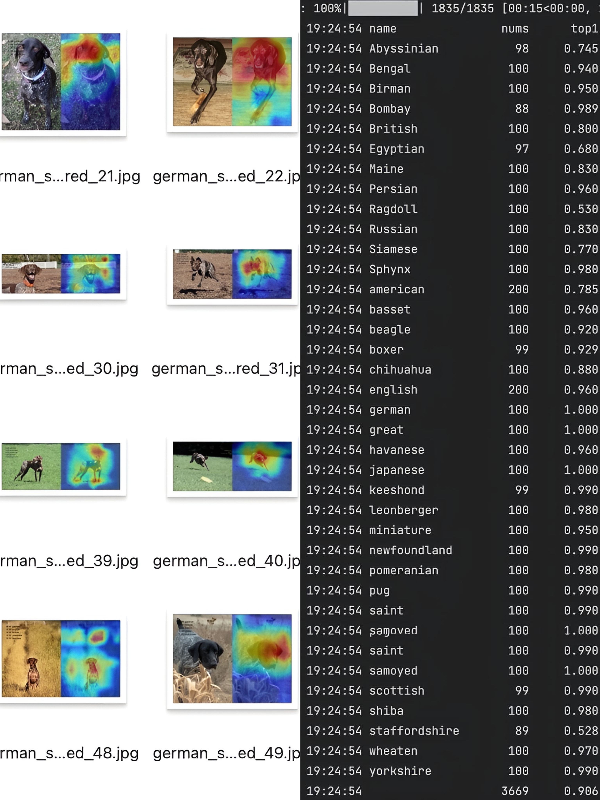

# <div align="center">Image Classification</div>

## 🚀 Quick Start

### 1. Data Preparation

- [Oxford IIIT Pet Dataset](../../oxford-iiit-pet/README.md): 37 categories, ~200 images per category.
- Custom Data: Organize your data as follows:
  ```txt
    data/pet/
  ├── train/
  │   ├── Abyssinian/
  │   │   ├── Abyssinian_1.jpg
  │   │   ├── Abyssinian_2.jpg
  │   │   └── ...
  │   ├── Beagle/
  │   │   ├── Beagle_1.jpg
  │   │   ├── Beagle_2.jpg
  │   │   └── ...
  │   └── ...
  └── val/
      ├── Abyssinian/
      │   ├── Abyssinian_101.jpg
      │   ├── Abyssinian_102.jpg
      │   └── ...
      ├── Beagle/
      │   ├── Beagle_101.jpg
      │   ├── Beagle_102.jpg
      │   └── ...
      └── ...

  ```
- For multiple images in category folders, use:
  ```
  python tools/data_prepare.py --postfix <jpg|png> --root <data_path> --frac <train_set_ratio>
  ```

### 2. Configuration

- Oxford IIIT Pet: Use [pet.yaml](../../configs/classification/pet.yaml)
- Custom Data: Modify [pet.yaml](../../configs/classification/pet.yaml)
- To switch between local and Hugging Face datasets, modify the data.root field in pet.yaml:
  ```txt
  data:
    root: data/pet  # For local dataset
    # or
    root: dataset_name/config  # For Hugging Face dataset (e.g., StarQuestLab/oxford-iiit-pet)
  ```


### 3. Training

```shell
# Single GPU
python main.py --cfgs configs/classification/pet.yaml

# Multi-GPU
CUDA_VISIBLE_DEVICES=0,1,2,3,4,5,6,7 torchrun --nproc_per_node 8 main.py --cfgs configs/classification/pet.yaml

# Optional flags:
#   --sync_bn         # Synchronize BatchNorm (slower training)
#   --resume          # Resume from checkpoint
#   --load_from       # Fine-tune from pre-trained weights
```

### 4. Validation & Visualization

After training, you'll find these commands in the log:

```shell
# Predict and Visualize
python visualize.py --cfgs /path/to/pet.yaml --weight /path/to/best.pt --class_json /path/to/class_indices.json --data /path/to/val/XXX_cls

# Optional flags:
#   --ema             # Use EMA weights
#   --cam             # Show attention heatmap
#   --badcase         # Group misclassified images
#   --target_class    # Specify category to check (for --badcase)
#   --auto_label      # Auto-labeling for active learning
#   --sampling N      # Sample N images for visualization

# Validate
python validate.py --cfgs /path/to/pet.yaml --eval_topk 5 --weight /path/to/best.pt

# Optional flag:
#   --ema             # Use EMA weights
```

## 📊 Results

Here's a sample of the visualization and validation results:

<p align="center">
  
</p>

## 🔍 Advanced Features

### Hugging Face Dataset Support

You can now use Hugging Face datasets directly:

```shell
python main.py --cfgs configs/classification/pet.yaml
```

### Badcase Analysis

To analyze misclassified images and view attention heatmaps:

```shell
python visualize.py --cfgs /path/to/pet.yaml --weight /path/to/best.pt --badcase --class_json /path/to/class_indices.json --ema --cam --data /path/to/val/CLS
```

### Auto-labeling for Active Learning

For automatic labeling of new data:

```shell
python visualize.py --cfgs /path/to/pet.yaml --weight /path/to/best.pt --class_json /path/to/class_indices.json --ema --auto_label --data /path/to/new_images
```

This README now provides a clear, concise overview of the project's features and usage, with a focus on readability and visual appeal. The structure guides users from data preparation through training to advanced features like badcase analysis and auto-labeling.