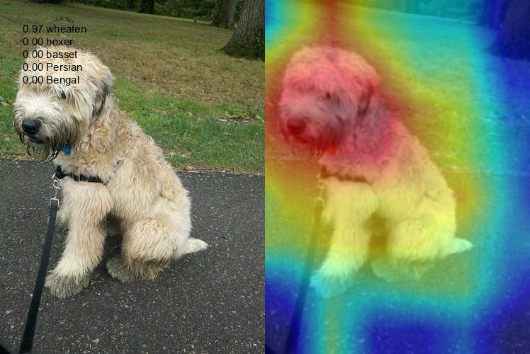
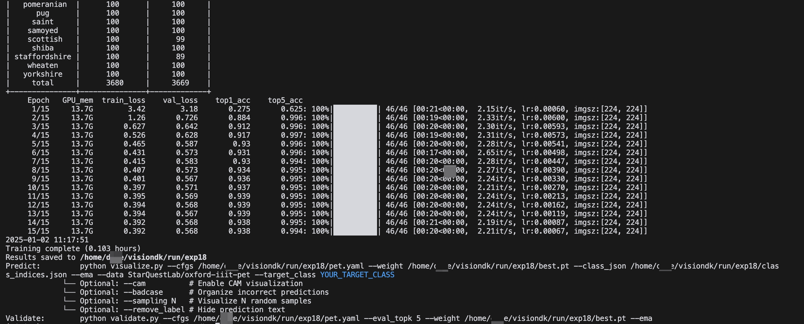

# <div align="center">Image Classification</div>                                                                                                                                                          
 
## 📦 Data Preparation
 
### Quick Start with Pre-prepared Datasets
1. **Using HuggingFace Dataset (Recommended)**
   
   Dataset: [wuji3/oxford-iiit-pet](https://huggingface.co/datasets/wuji3/oxford-iiit-pet)
   ```yaml
   # In your config file (e.g., configs/classification/pet.yaml)
   data:
     root: wuji3/oxford-iiit-pet
   ```
 
2. **Download Pre-prepared Dataset**
   - Oxford-IIIT Pet Dataset (37 pet breeds)
     - [Download from Baidu Cloud](https://pan.baidu.com/s/1PjM6kPoTyzNYPZkpmDoC6A) (Code: yjsl) **Recommended**
     - [Download from Official URL](https://s3.amazonaws.com/fast-ai-imageclas/oxford-iiit-pet.tgz)
   ```bash
   # After downloading:
   cd data
   tar -xf oxford-iiit-pet.tgz
   python split2dataset.py
   ```
 
### Training with Your Own Dataset
You can prepare your data in either single-label or multi-label format:
 
#### Option 1: Single-label Format
```
your_dataset/
├── train/
│   ├── class1/             # Folder name = class name
│   │   ├── image1.jpg
│   │   └── ...
│   └── class2/
│       └── ...
└── val/
    ├── class1/
    │   └── ...
    └── class2/
        └── ...
```
 
#### Option 2: Multi-label Format (CSV)
Create a CSV file with the following structure:
```csv
image_path,tag1,tag2,tag3,train
/path/to/image1.jpg,1,0,1,True    # 1=has_tag, 0=no_tag
/path/to/image2.jpg,0,1,0,True    # True=training set
```
 
### Data Preparation Helper
Convert a folder of categorized images into the required training format:
```bash
# If your data structure is:
# your_dataset/
# ├── class1/
# │   ├── img1.jpg
# │   └── img2.jpg
# ├── class2/
# │   ├── img3.jpg
# │   └── img4.jpg
# └── ...

python tools/data_prepare.py \
    --root path/to/your/images \
    --postfix jpg \          # Image format: jpg or png
    --frac 0.8              # Split ratio: 80% training, 20% validation
```
 
This script will automatically:
1. Create train/ and val/ directories
2. Split images from each class into training and validation sets
3. Maintain the class folder structure in both sets
 
## 🧊 Models
 
### Model Configuration
```yaml
model:
  task: classification
  name: timm-swin_base_patch4_window7_224  # Format: timm-{model_name}
  image_size: 224
  num_classes: 35
  pretrained: True
  kwargs: {}  # Additional parameters for model initialization
```
 
### Available Models
```python
import timm
timm.list_models(pretrained=True)  # ['beit_base_patch16_224.in22k_ft_in22k', 'swin_base_patch4_window7_224.ms_in22k_ft_in1k', 'vit_base_patch16_siglip_224.webli', ...]
```

## 🚀 Training
 
### Basic Training
```bash
# Single GPU training
python main.py --cfgs configs/classification/pet.yaml
 
# Multi-GPU training
CUDA_VISIBLE_DEVICES=0,1,2,3 torchrun --nproc_per_node 4 main.py \
    --cfgs configs/classification/pet.yaml
```
 
### Advanced Options
```bash
# Resume interrupted training
python main.py --cfgs configs/classification/pet.yaml --resume path/to/model.pt
 
# Enable synchronized BatchNorm for multi-GPU
python main.py --cfgs configs/classification/pet.yaml --sync_bn
```
 
### Monitor Training
```bash
# View real-time training log
tail -f run/exp/log{timestamp}.log  # e.g., log20241113-155144.log
```
 
## 📊 Evaluation & Visualization
 
### Visualize Model Predictions

#### Scenario 1: Case Analysis with Attention Maps
Analyze model predictions and visualize attention maps to understand model behavior:
```bash
python visualize.py \
    --cfgs <path/to/config.yaml> \
    --weight <path/to/model.pt> \
    --class_json <path/to/class_indices.json> \
    --ema \
    --data <path/to/dataset> \
    --target_class <class_name> \
    --cam \                    # Show attention heatmaps
    --badcase \               # Group wrong predictions
    --sampling 10             # Optional: analyze 10 random samples, default: all samples
```

This scenario helps you:
- Visualize model's attention focus using GradCAM
- Identify and group misclassified samples
- Analyze specific class performance
- Random sample subset for quick analysis

<div align="center">
  
</div>
<p align="center">
  <em>Example of GradCAM visualization showing model's attention regions</em>
</p>

#### Scenario 2: Semi-supervised Learning
Generate pseudo labels for unlabeled data to support semi-supervised learning:
```bash
python visualize.py \
    --cfgs <path/to/config.yaml> \
    --weight <path/to/model.pt> \
    --class_json <path/to/class_indices.json> \
    --ema \
    --data <path/to/unlabeled_data> \
    --remove_label \          # Don't show predictions on the top-left corner of images
    --no_save_image          # Optional: don't save inference images, output infer-result only
```

This scenario helps you:
- Generate pseudo labels for unlabeled data
- Save predictions in txt format for further filtering
- Optionally skip saving inference images to save storage
- Support iterative semi-supervised training

### Validate Model Performance
```bash
python validate.py \
    --cfgs <path/to/config.yaml> \
    --weight <path/to/model.pt> \
    --eval_topk 5
```
 
## 🖼️ Example
 
<p align="center">
  
  <br>
  <em>Training</em>
</p>                                              
