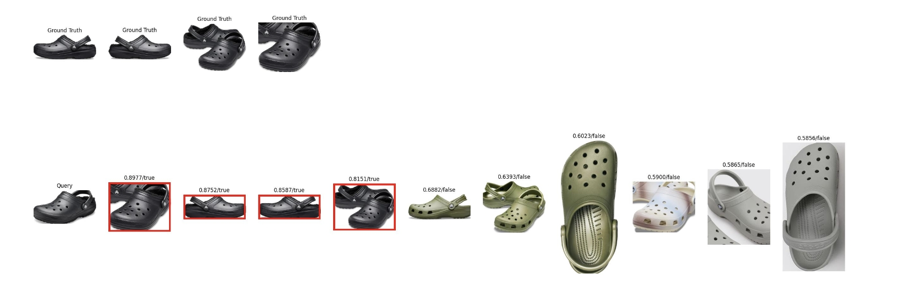
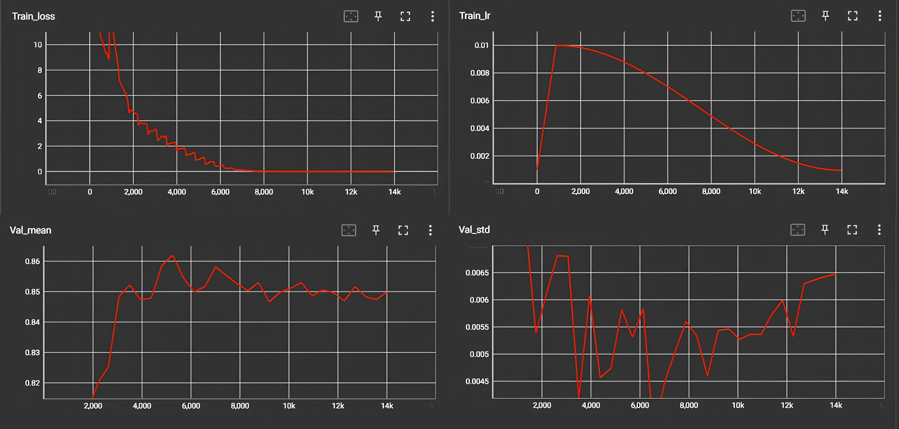

## <div align="center">Face Recognition/ Content-Based Image Retrieval</div>

## Tutorials
<details open>
<summary>Data</summary>

1. Training Data: We use [MS-Celeb-1M-v1c](http://trillionpairs.deepglint.com/data) for conventional training. To remove the identities which may overlap between this dataset, a cleaner id-list can be found in [CLEAN](https://github.com/IvyHuang-25/CleanAndRelabel-MS-Celeb-1M). After washing, the dataset contains 79077 identities, over 367 million faces.
2. Testing Data: We provide [LFW](https://pan.baidu.com/s/1y4UXQkjv5PnY_6CTV_K2xQ), extracted code is **yjsl**. Including data and pairs.txt.
3. Testing Data For Face Evaluation Only Support 5000~6000 Pairs Now.
```markdone
facedata/
├── pairs.txt
├── train
│   └── 11272
│       ├── 0-FaceId-0.jpg
│       └── 1-FaceId-0.jpg
└── val
    ├── Micky_Ward
    │   └── Micky_Ward_0001.jpg
    └── Miguel_Aldana_Ibarra
        └── Miguel_Aldana_Ibarra_0001.jpg


cbir
├── gallery
│   ├── B000A2K9MC#0
│   │   └── B000A2K9MC#6-0.jpg
│   └── B00AKSCZ6Y#0
│       ├── B00AKSCZ6Y#1-0.jpg
│       └── B00AKSCZ6Y#3-0.jpg
├── query
│   └── B000A2K9MC#0
│       └── B000A2K9MC#1-0.jpg
└── train
    └── B00A2BS91E#1
        ├── B00A2BS91E#1-0.jpg
        ├── B00A2BS91E#13-0.jpg
        ├── B00A2BS91E#14-0.jpg
        └── B00A2BS91E#6-1.jpg
```
</details>

<details open>
<summary>Configuration ️</summary>

[Config Instructions](../../configs/faceX/README.md) Is All You Need 🌟
- [MS CELEB] [face.yaml](../../configs/faceX/face.yaml) has prepared for you.
- [Custom Data]  Modify based on [face.yaml](../../configs/faceX/face.yaml)

</details>

<details open>
<summary>Training 🚀️️</summary>

```shell
# one machine one gpu 
# FACE 
python main.py --cfgs configs/faceX/face.yaml
# CBIR
python main.py --cfgs configs/faceX/cbir.yaml

# one machine multiple gpus FACE/CBIR
# FACE
CUDA_VISIBLE_DEVICES=0,1,2,3 torchrun --nproc_per_node 4 main.py --cfgs configs/faceX/face.yaml --print_freq 50 --save_freq 5
                                                                 --sync_bn[Option: this will lead to training slowly]
                                                                 --resume[Option: training from checkpoint]
# CBIR                                                        
CUDA_VISIBLE_DEVICES=0,1,2,3 torchrun --nproc_per_node 4 main.py --cfgs configs/faceX/cbir.yaml --print_freq 50 --save_freq 5
                                                                 --sync_bn[Option: this will lead to training slowly]
                                                                 --resume[Option: training from checkpoint]
                                                                 --load_from[Option: training from fine-tuning]
                                                        
## [CBIR] If want load ImageNet pretrained weight, run the command below. Refer to models/faceX/backbone/pretrained_models.py
CUDA_VISIBLE_DEVICES=0,1,2,3 torchrun --nproc_per_node 4 main.py --cfgs configs/faceX/cbir.yaml --print_freq 50 --save_freq 5 --load_from torchvision-swin_b
```

</details>

<details open>
<summary>Validate & Visualization 🌟</summary>

```shell
# FACE
python validate.py --cfgs configs/faceX/face.yaml --weight /root/xxx/vision/run/exp/which_weight --ema[Option: may improve performance a bit] 
# CBIR
python validate.py --cfgs configs/faceX/cbir.yaml --weight /root/xxx/vision/run/exp/which_weight --ema[Option: may improve performance a bit] 

```

Result of cbir validate.py 
<p align="center">
  
</p>

```shell
# CBIR
python visualize.py --cfgs run/exp/cbir.yaml --weight run/exp/Epoch_27.pt --max_rank 10
```

<p align="center">
  
</p>
</details>

```shell
# You may want to observe some trends, such as Train_loss, Train_lr, Val_mean, Val_std
tensorboard --logdir /root/xxx/vision/run/exp
```

The picture below is the training result using 563 identities(27972 images, 32 epochs). It is for visual reference only.
<p align="center">
  
</p>
</details>

## Experiment
### Face
| Backbone | MS CELEB |    Device     | Period         | LFW w/o EMA |
|:--------:|:--------:|:-------------:|:---------------|:--------------:| 
| ResNet50 | 10000 ID | RTX2080Ti x 2 | 30Epoch/600min | 98.01%/98.21%  |
