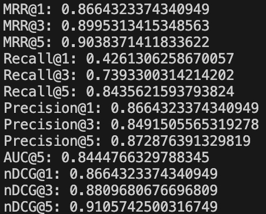

# <div align="center">Image Retrieval</div>

## 📦 Data Preparation


You can use either pre-prepared datasets or your own dataset for training.

### Option 1: Pre-prepared Datasets

**Using HuggingFace Dataset (Recommended)**
   
Dataset: [wuji3/image-retrieval](https://huggingface.co/datasets/wuji3/image-retrieval)
```yaml
# In your config file (e.g., configs/faceX/cbir.yaml)
data:
  root: wuji3/image-retrieval
```

### Option 2: Custom Dataset

#### Dataset Structure

Organize your data in the following structure:
```
your_dataset/
├── train/
│   ├── class1/             # Folder name = class/ID name
│   │   ├── image1.jpg
│   │   └── ...
│   └── class2/
│       └── ...
├── gallery/                # Query database
│   ├── class1/
│   │   └── ...
│   └── class2/
│       └── ...
└── query/                  # Query images
    ├── class1/
    │   └── ...
    └── class2/
        └── ...
```

Note:
- IDs in query set should be a subset of gallery set
- Gallery set can contain additional ID categories
- Each ID folder contains different images of the same identity

#### Data Preparation Tools

We provide a convenient tool for dataset construction:

```bash
python tools/build_querygallery.py --src <path> --frac <ratio>
```

This tool will transform your original data:
```
data/
  └── ID1/
      ├── xxx1.jpg
      └── xxx2.jpg
  └── ID2/
      ├── xxx3.jpg
      └── xxx4.jpg
```

Into retrieval format:
```
data/
  └── data-query/
      └── ID1/
          └── xxx1.jpg
      └── ID2/
          └── xxx3.jpg
  └── data-gallery/
      └── ID1/
          └── xxx2.jpg
      └── ID2/
          └── xxx4.jpg
```

## 🧊 Models

### Model Configuration

The model configuration includes backbone and head components:

```yaml
model:
  task: cbir
  image_size: &imgsz 224
  load_from: null
  backbone:
    timm-resnet50d.gluon_in1k:  # Multiple backbones supported
      pretrained: True
      image_size: *imgsz
      feat_dim: &featd 128 
  head:
    arcface:  # Support multiple loss functions
      feat_dim: *featd
      num_class: 5000
      margin_arc: 0.35
      margin_am: 0.0
      scale: 32
```

### Supported Loss Functions

Supported heads: [ArcFace](https://arxiv.org/abs/1801.07698), [MagFace](https://arxiv.org/abs/2103.06627), [CircleLoss](https://arxiv.org/abs/2002.10857), [MV-Softmax](https://arxiv.org/abs/1912.00833)

Configure the desired loss function in the `head` section of your config file.

### Available Models
```python
import timm
timm.list_models(pretrained=True)  # ['beit_base_patch16_224.in22k_ft_in22k', 'swin_base_patch4_window7_224.ms_in22k_ft_in1k', 'vit_base_patch16_siglip_224.webli', ...]
```

## 🚀 Training

### Basic Training
```bash
# Single GPU training
python main.py --cfgs configs/faceX/cbir.yaml

# Multi-GPU training
CUDA_VISIBLE_DEVICES=0,1,2,3 torchrun --nproc_per_node 4 main.py \
    --cfgs configs/faceX/cbir.yaml \
    --print_freq 50 \    # Print log every 50 steps
    --save_freq 5        # Save checkpoint and validate every 5 epochs
```

## 📊 Evaluation

### Metrics
We support multiple evaluation metrics:
- MRR (Mean Reciprocal Rank)
- Recall@K
- Precision@K
- AUC
- NDCG@K

Configure evaluation parameters in your config file:
```yaml
metrics:
  metrics: [mrr, recall, precision, auc, ndcg]
  cutoffs: [1, 3, 5]  # Evaluate performance at top1, top3, and top5
```

### Run Evaluation
```bash
python validate.py \
    --cfgs /workspace/run/expX/cbir.yaml \
    --weight /workspace/run/expX/Epoch_X.pt \
    --ema
```

## 🖼️ Example

<p align="center">
  
  <br>
  <em>Retrieval Results</em>
</p>